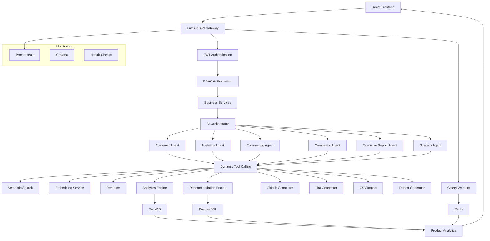

# 🚀 Product Intelligence
### Autonomous Product Intelligence Platform powered by Multi-Agent AI

<p align="center">


</p>

---

## 📖 Overview

**Product Intelligence** is an enterprise-grade Autonomous Product Intelligence Platform that continuously collects, analyzes, and transforms product data into actionable insights using AI-powered autonomous agents.

Modern product managers spend hours reviewing customer feedback, engineering tickets, analytics dashboards, competitor updates, and product metrics across multiple tools. ProductOS AI automates this workflow by integrating diverse data sources, processing them through specialized AI agents, and generating intelligent recommendations, reports, and strategic insights in real time.

The platform combines transactional data management with analytical processing by leveraging **PostgreSQL** for OLTP workloads and **DuckDB** for high-performance analytical queries, enabling scalable, production-ready product intelligence.

---

# ✨ Key Features

### 🤖 Multi-Agent AI System

- Customer Intelligence Agent
- Product Analytics Agent
- Engineering Health Agent
- Competitor Intelligence Agent
- Strategy Recommendation Agent
- Executive Reporting Agent
- PRD Generation Agent

---

### 📊 Product Analytics

- KPI Dashboards
- Customer Satisfaction Trends
- Feature Adoption Analytics
- Product Health Metrics
- Engineering Velocity
- Product Usage Insights

---

### 🔍 AI Search

- Semantic Search
- Embedding-based Retrieval
- Intelligent Ranking
- Context-aware Search

---

### 📈 Recommendation Engine

- Feature Prioritization
- Customer Pain Point Detection
- Engineering Bottleneck Analysis
- Competitor Gap Identification
- Product Improvement Suggestions

---

### 📄 AI Generated Reports

- Executive Reports
- Product Health Reports
- Sprint Summaries
- Customer Feedback Reports
- Weekly Analytics Reports

---

### ⚙️ Enterprise Features

- JWT Authentication
- Role-Based Access Control
- Multi-workspace Architecture
- Background Processing
- Analytics Engine
- Audit Logging
- Metrics Collection
- API Monitoring

---

## 🏗️ System Architecture


```

# 🧠 AI Pipeline

## 🔄 End-to-End Workflow

```text
User
 │
 ▼
React Dashboard
 │
 ▼
FastAPI API Gateway
 │
 ▼
JWT Authentication + RBAC
 │
 ▼
Business Services
 │
 ▼
Planner Agent
 │
 ▼
Dynamic Tool Calling
 │
 ├──────────────┐
 ▼              ▼
AI Agents     External Tools
 │              │
 │        GitHub / Jira / CSV
 │              │
 ▼              ▼
Embedding + Retrieval + Analytics
 │
 ▼
Recommendation Engine
 │
 ▼
DuckDB Analytics
 │
 ▼
PostgreSQL
 │
 ▼
JSON Response
 │
 ▼
Dashboard
```
---

# 📂 Project Structure

```
Product-Intelligence/

├── backend/
│   ├── agents/
│   ├── analytics/
│   ├── api/
│   ├── auth/
│   ├── connectors/
│   ├── core/
│   ├── database/
│   ├── embeddings/
│   ├── etl/
│   ├── middleware/
│   ├── models/
│   ├── notifications/
│   ├── observability/
│   ├── services/
│   ├── tasks/
│   └── utils/
│
├── frontend/
│   ├── components/
│   ├── pages/
│   ├── hooks/
│   ├── store/
│   ├── services/
│   ├── layouts/
│   └── assets/
│
├── infrastructure/
│   ├── docker/
│   ├── nginx/
│   ├── grafana/
│   ├── prometheus/
│   └── scripts/
│
├── docs/
│
└── README.md
```

---

# ⚡ Tech Stack

## Frontend

- React
- TypeScript
- Vite
- React Query
- Zustand
- Tailwind CSS
- ECharts

---

## Backend

- FastAPI
- SQLAlchemy
- PostgreSQL
- Redis
- Celery
- JWT Authentication
- Alembic

---

## AI & ML

- LLM Integration
- Embedding Service
- Semantic Search
- Retrieval Pipeline
- Multi-Agent Framework

---

## Analytics

- DuckDB
- KPI Engine
- ETL Pipelines
- Data Processing

---

## Infrastructure

- Docker
- Nginx
- Prometheus
- Grafana

---

# 🚀 Core Capabilities

✅ Product Analytics

✅ Customer Intelligence

✅ Semantic Search

✅ AI Recommendations

✅ KPI Monitoring

✅ Executive Reports

✅ Competitor Analysis

✅ Engineering Health

✅ Product Insights

✅ Workspace Management

---

# 🔒 Security

- JWT Authentication
- Password Hashing
- RBAC
- Protected APIs
- Environment Variables
- Input Validation

---

# 📊 Observability

- Prometheus Metrics
- Grafana Dashboards
- Structured Logging
- Request Monitoring
- Health Checks

---

# ⚙️ Local Setup

## Clone Repository

```bash
git clone https://github.com/<username>/product-intelligence.git
cd product-intelligence
```

---

## Backend

```bash
cd backend

python -m venv venv

source venv/bin/activate

pip install -r requirements.txt

alembic upgrade head

uvicorn app.main:app --reload
```

---

## Frontend

```bash
cd frontend

npm install

npm run dev
```

---

# 📈 Roadmap

- [x] Authentication
- [x] Multi-Agent System
- [x] Semantic Search
- [x] Analytics Engine
- [x] Recommendation Engine
- [x] Background Workers
- [x] Observability
- [ ] LangGraph Orchestration
- [ ] Vector Database Integration
- [ ] Real-time Streaming
- [ ] Slack Integration
- [ ] Kubernetes Deployment

---

# 🤝 Contributing

Contributions are welcome!

Please open an issue before submitting major changes.

---

# 📜 License

MIT License

---

# 👨‍💻 Author

**Sumit Prakash**

AI Engineer | Backend Engineer | Product Intelligence

📫 **Connect with me**

<p align="left">
  <a href="https://github.com/sumitsingh190" target="_blank">
    
  </a>

  <a href="https://www.linkedin.com/in/sumitprakash13" target="_blank">
    
  </a>
</p>

⭐ If you found this project interesting, consider giving it a star!
