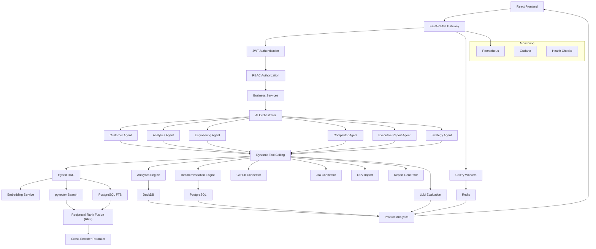
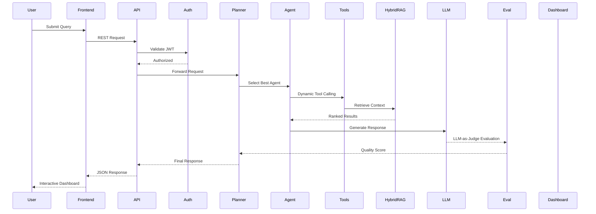

# 🚀 Product Intelligence
### Autonomous Product Intelligence Platform powered by Multi-Agent AI

<p align="center">


</p>

---

## 📖 Overview

**Product Intelligence** is an enterprise-grade Autonomous Product Intelligence Platform that continuously collects, analyzes, and transforms product data into actionable insights using AI-powered autonomous agents.

Modern product managers spend hours reviewing customer feedback, engineering tickets, analytics dashboards, competitor updates, and product metrics across multiple tools. ProductOS AI automates this workflow by integrating diverse data sources, processing them through specialized AI agents, and generating intelligent recommendations, reports, and strategic insights in real time.

The platform combines transactional data management with analytical processing by leveraging **PostgreSQL** for OLTP workloads and **DuckDB** for high-performance analytical queries, enabling scalable, production-ready product intelligence.

---
## 🎯 Problem Statement

Product teams often rely on disconnected sources such as customer feedback, support tickets, product analytics, engineering data, and competitor research. Manually consolidating these signals is time-consuming, making prioritization, roadmap planning, and strategic decision-making reactive instead of data-driven.

Product Intelligence addresses this challenge by unifying these data sources and leveraging autonomous AI agents, Hybrid RAG, and enterprise analytics to generate contextual recommendations, executive reports, PRDs, and actionable product insights from a single platform.
---

# ✨ Key Features

## 🎯 Key Highlights

- 🤖 7 Specialized AI Agents
- 🔍 Hybrid RAG Pipeline (pgvector + PostgreSQL FTS + RRF + Reranking)
- 🧠 LLM-as-Judge Evaluation Framework
- 📊 DuckDB Analytics Engine
- ⚡ FastAPI + Celery Backend
- 📈 Prometheus & Grafana Monitoring
- 🔐 JWT + RBAC Security

### 🤖 Multi-Agent AI System

- Customer Intelligence Agent
- Product Analytics Agent
- Engineering Health Agent
- Competitor Intelligence Agent
- Strategy Recommendation Agent
- Executive Reporting Agent
- PRD Generation Agent

---

### 📊 Product Analytics

- KPI Dashboards
- Customer Satisfaction Trends
- Feature Adoption Analytics
- Product Health Metrics
- Engineering Velocity
- Product Usage Insights

---

### 🔍 AI Search

- Hybrid RAG
- pgvector Retrieval
- PostgreSQL Full-Text Search
- Reciprocal Rank Fusion (RRF)
- Cross-Encoder Reranking

---

### 📈 Recommendation Engine

- Feature Prioritization
- Customer Pain Point Detection
- Engineering Bottleneck Analysis
- Competitor Gap Identification
- Product Improvement Suggestions

---

### 📄 AI Generated Reports

- Executive Reports
- Product Health Reports
- Sprint Summaries
- Customer Feedback Reports
- Weekly Analytics Reports

---

### ⚙️ Enterprise Features

- JWT Authentication
- Role-Based Access Control
- Multi-workspace Architecture
- Background Processing
- Analytics Engine
- Audit Logging
- Metrics Collection
- API Monitoring

---

## 🏗️ System Architecture


# 🧠 AI Request Lifecycle


---

# 📂 Project Structure

```
Product-Intelligence/

├── backend/
│   └── app/
│       ├── agents/
│       │   ├── analytics_agent.py
│       │   ├── competitor_agent.py
│       │   ├── customer_intelligence_agent.py
│       │   ├── engineering_agent.py
│       │   ├── executive_reporting_agent.py
│       │   ├── planner_agent.py
│       │   ├── prd_agent.py
│       │   ├── product_strategy_agent.py
│       │   ├── sprint_plan_agent.py
│       │   ├── tools.py
│       │   ├── validator.py
│       │   └── evals/
│       │       ├── judge.py
│       │       ├── metrics.py
│       │       ├── runner.py
│       │       ├── eval_customer_intelligence.py
│       │       ├── eval_product_strategy.py
│       │       └── eval_prd.py
│       │
│       ├── analytics/
│       ├── api/
│       ├── connectors/
│       ├── core/
│       ├── embeddings/
│       ├── etl/
│       ├── models/
│       ├── notifications/
│       ├── observability/
│       ├── schemas/
│       ├── services/
│       ├── tasks/
│       ├── utils/
│       ├── database.py
│       ├── deps.py
│       ├── config.py
│       └── main.py
│
├── frontend/
│
├── infrastructure/
│   ├── docker/
│   ├── nginx/
│   ├── grafana/
│   ├── prometheus/
│   └── scripts/
│
├── docs/
│
└── README.md
```

---

# ⚡ Tech Stack

## Frontend

- React
- TypeScript
- Vite
- React Query
- Zustand
- Tailwind CSS
- ECharts

---

## Backend

- FastAPI
- SQLAlchemy
- PostgreSQL
- Redis
- Celery
- JWT Authentication
- Alembic

---

## AI & ML

- LangGraph
- Multi-Agent AI
- Hybrid RAG
- pgvector
- LLM-as-Judge
- Embedding Models
- pgvector
- Hybrid RAG
- Cross-Encoder Reranking
  
---

## Analytics

- DuckDB
- KPI Engine
- ETL Pipelines
- Data Processing

---

## Infrastructure

- Docker
- Nginx
- Prometheus
- Grafana

---

# 🚀 Core Capabilities

✅ Product Analytics

✅ AI Agent Orchestration

✅ Customer Intelligence

✅ Semantic Search

✅ AI Recommendations

✅ KPI Monitoring

✅ Executive Reports

✅ Competitor Analysis

✅ Engineering Health

✅ Product Insights

✅ Workspace Management

✅ Hybrid RAG

✅ LLM Evaluation

---

# 🔒 Security

- JWT Authentication
- Password Hashing
- RBAC
- Protected APIs
- Environment Variables
- Input Validation

---

# 📊 Observability

- Prometheus Metrics
- Grafana Dashboards
- Structured Logging
- Request Monitoring
- Health Checks

  # 🧪 LLM Evaluation

The platform includes a production-ready evaluation framework for continuously validating AI agent performance and retrieval quality.
Evaluation pipelines support offline benchmarking, regression testing, and automated quality validation for AI agents before deployment.

### Evaluation Features

- LLM-as-Judge
- Precision / Recall / F1
- NDCG@K Ranking Evaluation
- Rubric-based Scoring
- Offline Evaluation Suites
- Regression Testing
- JSON Evaluation Reports
- Configurable Pass Rate Thresholds

---

# ⚙️ Local Setup

## Clone Repository

```bash
git clone https://github.com/sumitsingh190/Product-Intelligence.git
cd product-intelligence
```

---

## Backend

```bash
cd backend

python -m venv venv

source venv/bin/activate

pip install -r requirements.txt

alembic upgrade head

uvicorn app.main:app --reload
```

---

## Frontend

```bash
cd frontend

npm install

npm run dev
```

---

# 📈 Roadmap

- [x] Authentication
- [x] Multi-Agent System
- [x] Semantic Search
- [x] Analytics Engine
- [x] Recommendation Engine
- [x] Background Workers
- [x] Observability
- [x] Advanced Multi-Agent Planning
- [x] Advanced Hybrid Retrieval Optimization
- [x] Multi-Agent Collaboration
- [x] Real-time Streaming
- [x] Slack Integration
- [x] Kubernetes Deployment

---

# 🤝 Contributing

Contributions are welcome!

Please open an issue before submitting major changes.

---

# 📜 License

MIT License

---

# 👨‍💻 Author

**Sumit Prakash**

AI Engineer | Backend Engineer | Product Intelligence

📫 **Connect with me**

<p align="left">
  <a href="https://github.com/sumitsingh190" target="_blank">
    
  </a>

  <a href="https://www.linkedin.com/in/sumitprakash13" target="_blank">
    
  </a>
</p>

⭐ If you found this project interesting, consider giving it a star!
