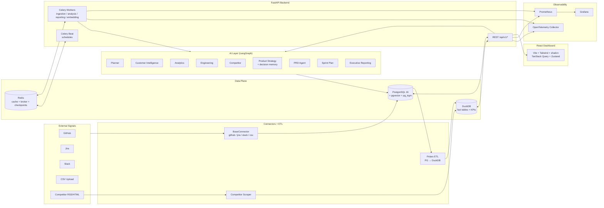

# ProductOS AI


 

> **Autonomous Product Operating System** — a production-grade AI platform that ingests product

> signals from GitHub, Jira, Slack, app stores, analytics, and CSVs, then generates

> **insights, ROI-scored recommendations, PRDs, sprint plans, and executive reports** on

> autopilot.


 

ProductOS AI runs 9 specialised LangGraph agents on top of a hybrid PostgreSQL + DuckDB

data plane, exposes everything through a FastAPI backend, and ships a React 18 + shadcn/ui

dashboard for humans in the loop.


 

---


 

## Table of Contents


 

- [Highlights](#highlights)

- [Architecture](#architecture)

- [Tech Stack](#tech-stack)

- [Repository Layout](#repository-layout)

- [Prerequisites](#prerequisites)

- [Environment Variables](#environment-variables)

- [Quick Start (Docker Compose)](#quick-start-docker-compose)

- [Running Locally without Docker](#running-locally-without-docker)

- [Application URLs](#application-urls)

- [First-Time Usage Walkthrough](#first-time-usage-walkthrough)

- [AI Agents](#ai-agents)

- [Data Source Connectors](#data-source-connectors)

- [Background Jobs & Schedules](#background-jobs--schedules)

- [REST API Overview](#rest-api-overview)

- [Frontend Pages](#frontend-pages)

- [Feature Flags](#feature-flags)

- [Observability](#observability)

- [Testing](#testing)

- [Production Deployment](#production-deployment)

- [Common Commands](#common-commands)

- [Troubleshooting](#troubleshooting)

- [Security Notes](#security-notes)

- [Documentation](#documentation)

- [License](#license)


 

---


 

## Highlights


 

- **9 LangGraph agents** — Planner, Customer Intelligence, Analytics, Engineering,

  Competitor, Product Strategy (with decision memory), PRD, Sprint Plan, Executive Reporting.

- **Groq `llama-3.3-70b-versatile`** for LLM inference (fast, low-cost) with per-call

  token / latency / USD cost metrics.

- **Google `text-embedding-004` (768-dim)** embeddings powering **hybrid semantic + keyword search**

  over `pgvector` (ivfflat) and `pg_trgm`, with RAG chunking for long documents.

- **Hybrid data plane**: PostgreSQL 16 (+ pgvector, pg_trgm) for OLTP, DuckDB + Polars for OLAP.

- **4 built-in connectors**: GitHub, Jira, Slack, CSV upload (Zendesk, Intercom, App Store,

  Google Play, Mixpanel are configurable stubs).

- **Full report automation**: PRDs, sprint plans, executive reports, product-health snapshots,

  overnight briefings — all exportable to **Markdown, HTML, and PDF (WeasyPrint)**.

- **Anomaly detection every 15 min** with event-driven agent re-runs.

- **Prometheus + Grafana + OpenTelemetry** wired end-to-end, with Grafana auto-provisioned

  dashboards and Prometheus alert rules.

- **JWT auth + RBAC** (`owner / admin / member / viewer`), workspace isolation on every read

  and write.

- **Docker Compose** for dev and production, nginx TLS/CSP at the edge.


 

See [features.md](features.md) for the exhaustive feature catalogue.


 

---


 

## Architecture


 




 

**Design principles** (see [CLAUDE.md](CLAUDE.md)):


 

1. **Docs-first** — architectural decisions live in [docs/](docs/) before implementation.

2. **OLTP / OLAP separation** — PostgreSQL for transactional state, DuckDB for analytics.

3. **Async-first backend** — every FastAPI endpoint and DB call uses `async/await`.

4. **One responsibility per agent** — narrowly scoped, structured Pydantic outputs.

5. **Explainable recommendations** — every recommendation carries evidence and reasoning.


 

---


 

## Tech Stack


 

| Layer              | Technology                                              | Version               |

| ------------------ | ------------------------------------------------------- | --------------------- |

| Backend framework  | FastAPI + Uvicorn / Gunicorn                            | 0.115 / Python 3.12   |

| ORM                | SQLAlchemy 2.0 (async) + Alembic                        | 2.0.36                |

| Primary DB         | PostgreSQL + pgvector + pg_trgm                         | 16                    |

| Cache / Broker     | Redis                                                   | 7                     |

| Task queue         | Celery                                                  | 5.4                   |

| Analytics warehouse| DuckDB + Polars + PyArrow                               | 1.x                   |

| AI orchestration   | LangGraph + LangChain Core                              | 0.2.60 / 0.3.28       |

| LLM                | Groq `llama-3.3-70b-versatile` (configurable)           | via `langchain-groq`  |

| Embeddings         | Google `text-embedding-004` (768-dim)                   | `google-generativeai` |

| PDF rendering      | WeasyPrint + Jinja2 + Markdown                          | 63.1                  |

| Scraping           | feedparser + BeautifulSoup4 + lxml                      | latest                |

| Frontend           | React 18 + Vite 6 + TypeScript 5.7                      | 5.7                   |

| Styling            | Tailwind CSS 3 + shadcn/ui + Radix UI                   | 3.4                   |

| State              | TanStack Query v5 + Zustand                             | 5.x / 5.x             |

| Charts             | Apache ECharts 5 (`echarts-for-react`)                  | 5.5                   |

| Auth (frontend)    | Axios with JWT interceptors + auto-refresh              | 1.7                   |

| Observability      | Prometheus, Grafana, OpenTelemetry, structlog           | latest                |

| Infra              | Docker Compose (dev + prod), nginx edge                 | v2 / 1.27             |


 

---


 

## Repository Layout


 

```

ProductOS_v4/

├── backend/

│   ├── alembic/                    # DB migrations (initial + agent_decisions + FTS)

│   ├── app/

│   │   ├── main.py                 # FastAPI app factory + lifespan

│   │   ├── config.py               # Pydantic settings (all env vars)

│   │   ├── database.py             # Async SQLAlchemy engine/session

│   │   ├── deps.py                 # FastAPI dependencies (auth, workspace)

│   │   ├── api/v1/                 # Route handlers (thin)

│   │   │   ├── router.py

│   │   │   └── endpoints/          # auth, workspaces, data_sources,

│   │   │                           # insights, recommendations, reports,

│   │   │                           # analytics, search

│   │   ├── services/               # Business logic (auth, insights, ...)

│   │   ├── models/                 # SQLAlchemy ORM models

│   │   ├── schemas/                # Pydantic v2 request/response models

│   │   ├── agents/                 # 9 LangGraph agents + base + tools + evals

│   │   ├── connectors/             # GitHub, Jira, Slack, CSV, competitor scraper

│   │   ├── etl/                    # Polars sync (PG → DuckDB)

│   │   ├── analytics/              # DuckDB manager, KPI engine, anomaly detector

│   │   ├── embeddings/             # Embedding service + reranker

│   │   ├── tasks/                  # Celery app, ingestion / analysis /

│   │   │                           # reporting / embedding tasks

│   │   ├── core/                   # Security (JWT, bcrypt), RBAC helpers

│   │   ├── notifications/          # SendGrid + Slack webhook (stubbed)

│   │   ├── observability/          # structlog, OTel, Prometheus glue

│   │   └── utils/                  # Logging + helpers

│   ├── scripts/                    # Retrieval eval harness

│   ├── tests/                      # pytest smoke suite + async fixtures

│   ├── Dockerfile                  # Multi-stage (base → deps → dev / prod)

│   ├── alembic.ini

│   └── pyproject.toml

├── frontend/

│   ├── src/

│   │   ├── pages/                  # DashboardPage, InsightsPage, RoadmapPage,

│   │   │                           # PRDCenterPage, ReportsPage, SearchPage,

│   │   │                           # CompetitorWatchPage, EngineeringHealthPage,

│   │   │                           # AgentActivityPage, SettingsPage, LoginPage

│   │   ├── components/             # Layout + shadcn primitives

│   │   ├── lib/                    # Axios client, hooks, helpers

│   │   ├── store/                  # Zustand (auth, workspace)

│   │   ├── types/                  # Shared TypeScript types

│   │   ├── App.tsx / main.tsx / index.css

│   ├── Dockerfile                  # Multi-stage (dev / builder / nginx-prod)

│   ├── nginx.conf                  # SPA routing for production image

│   ├── vite.config.ts / tsconfig.json / tailwind.config.ts

│   └── package.json

├── infrastructure/

│   ├── nginx/nginx.conf            # TLS + CSP + security headers (edge)

│   ├── prometheus/                 # prometheus.yml + alerts.yml

│   ├── grafana/provisioning/       # Datasource + dashboards

│   └── otel/otel-collector.yml

├── scripts/

│   └── init_db.sql                 # pgvector / uuid-ossp / pg_trgm bootstrap

├── docs/                           # 01-12 architecture docs (source of truth)

├── docker-compose.yml              # Dev stack

├── docker-compose.prod.yml         # Prod overrides (nginx, gunicorn, TLS)

├── features.md                     # Full feature catalogue

├── SETUP.md                        # Setup checklist

├── CLAUDE.md                       # Engineering rules for this repo

└── README.md                       # ← you are here

```


 

---


 

## Prerequisites


 

Choose **one** of the two paths below.


 

**Docker path (recommended, everything preconfigured):**


 

- [Docker Desktop](https://www.docker.com/products/docker-desktop) with Docker Compose v2

- ~6 GB free RAM for the full stack

- Free ports: `5432`, `6379`, `8000`, `5173`, `5555`, `9090`, `3001`, `4317`, `4318`


 

**Native path (advanced):**


 

- Python **3.12+**

- Node.js **20+** and npm 10+

- PostgreSQL **16** with the `vector`, `uuid-ossp`, and `pg_trgm` extensions

- Redis **7+**

- System libs for WeasyPrint (Cairo, Pango, GDK-PixBuf) — see WeasyPrint docs


 

**Required cloud credentials (both paths):**


 

- **Groq API key** — https://console.groq.com → API Keys

- **Google AI Studio API key** — https://aistudio.google.com/apikey


 

**Optional cloud credentials:** GitHub PAT, Jira API token, Slack bot token, Zendesk / Intercom

tokens, App Store Connect / Google Play service accounts, Mixpanel service account, SendGrid.


 

---


 

## Environment Variables


 

Create a `.env` file at the repo root (already gitignored). The file is consumed both by

`docker-compose.yml` and by the backend Pydantic `Settings` loader

(see [backend/app/config.py](backend/app/config.py)).


 

### Required


 

```env

# LLM (Groq)

GROQ_API_KEY=gsk_...

GROQ_MODEL=llama-3.3-70b-versatile


 

# Embeddings (Google AI Studio)

GOOGLE_API_KEY=AIza...

EMBEDDING_MODEL=models/text-embedding-004


 

# Auth secrets — generate two independent 64-char hex strings

SECRET_KEY=<64+ char random hex>

JWT_SECRET_KEY=<64+ char random hex — different from SECRET_KEY>

```


 

Generate the two secrets in PowerShell:


 

```powershell

-join ((1..64) | ForEach-Object { '{0:x}' -f (Get-Random -Max 16) })

```


 

Or in bash / zsh:


 

```bash

openssl rand -hex 64

```


 

### Database & infrastructure (defaults work with Docker Compose)


 

```env

POSTGRES_DB=productos_ai

POSTGRES_USER=productos

POSTGRES_PASSWORD=productos_password

POSTGRES_PORT=5432


 

# When running through Docker Compose these hosts are provided automatically

# via docker-compose.yml (see the x-backend-env anchor); override for native runs:

POSTGRES_HOST=localhost

REDIS_HOST=localhost

REDIS_URL=redis://localhost:6379/0

CELERY_BROKER_URL=redis://localhost:6379/1

CELERY_RESULT_BACKEND=redis://localhost:6379/2

AGENT_CHECKPOINT_REDIS_URL=redis://localhost:6379/3

DUCKDB_PATH=./data/analytics.duckdb

```


 

### Feature flags (all optional, defaults shown)


 

| Flag                             | Default | Effect                                                   |

| -------------------------------- | :-----: | -------------------------------------------------------- |

| `FEATURE_COMPETITOR_INTELLIGENCE`| `true`  | Enables competitor scraper + agent                       |

| `FEATURE_AUTO_PRD_GENERATION`    | `true`  | Enables `/reports/generate?report_type=prd`              |

| `FEATURE_SPRINT_PLANNING`        | `true`  | Enables sprint plan generation                           |

| `FEATURE_EXECUTIVE_REPORTS`      | `true`  | Enables weekly exec report Celery beat                   |

| `FEATURE_SEMANTIC_SEARCH`        | `true`  | Enables embedding pipeline + `/search`                   |

| `FEATURE_EMAIL_DIGESTS`          | `false` | Activates SendGrid path                                  |

| `FEATURE_SLACK_NOTIFICATIONS`    | `false` | Activates Slack webhook path                             |

| `AGENT_MEMORY_ENABLED`           | `true`  | LangGraph checkpointer for agent graphs                  |

| `OTEL_ENABLED`                   | `false` | OpenTelemetry instrumentation + OTLP export              |

| `PROMETHEUS_ENABLED`             | `true`  | Prometheus `/metrics` endpoint                           |


 

### Optional notification credentials


 

```env

SENDGRID_API_KEY=

SENDGRID_FROM_EMAIL=noreply@productos.ai

SLACK_WEBHOOK_URL=

```


 

> **Note.** Connector credentials (GitHub PAT, Jira token, Slack bot token, etc.) are **not**

> set via `.env`. They are stored per data source in the `DataSource.config` JSONB column

> and configured through the UI under **Settings → Data Source Connections**. They are

> redacted from all API responses via the `SENSITIVE_KEYS` list.


 

See [SETUP.md](SETUP.md) for the guided setup checklist.


 

---


 

## Quick Start (Docker Compose)


 

```bash

# 1. Clone and enter the repo

git clone <your-fork-url> ProductOS_v4

cd ProductOS_v4


 

# 2. Create your .env from the template and fill in the 4 required values

cp .env.example .env      # macOS / Linux

Copy-Item .env.example .env   # Windows PowerShell


 

# 3. Bring up PostgreSQL + Redis first

docker compose up -d postgres redis


 

# 4. Wait ~15s, then apply migrations

docker compose run --rm backend alembic upgrade head


 

# 5. Bring up the full stack

docker compose up -d


 

# 6. Verify

docker compose ps

```


 

Open http://localhost:5173, register an account, and start ingesting.


 

---


 

## Running Locally without Docker


 

```bash

# --- Backend ---

cd backend

python -m venv .venv && source .venv/bin/activate  # or .venv\Scripts\activate on Windows

pip install -e ".[dev]"


 

# Ensure Postgres has the extensions (see scripts/init_db.sql)

alembic upgrade head


 

# API

uvicorn app.main:app --reload --port 8000


 

# Celery worker (in a second terminal, same venv)

celery -A app.tasks.celery_app worker --loglevel=info -Q default,ingestion,analysis,reporting,embedding


 

# Celery beat (third terminal)

celery -A app.tasks.celery_app beat --loglevel=info


 

# --- Frontend (fourth terminal) ---

cd frontend

npm install

npm run dev

```


 

---


 

## Application URLs


 

| Service                          | URL                                | Credentials         |

| -------------------------------- | ---------------------------------- | ------------------- |

| Frontend                         | http://localhost:5173              | Register in the app |

| API Docs (Swagger)               | http://localhost:8000/docs         | —                   |

| API ReDoc                        | http://localhost:8000/redoc        | —                   |

| API health check                 | http://localhost:8000/health       | —                   |

| Prometheus metrics (backend)     | http://localhost:8000/metrics      | —                   |

| Prometheus UI                    | http://localhost:9090              | —                   |

| Grafana                          | http://localhost:3001              | `admin` / `admin`   |

| Celery Flower (task monitoring)  | http://localhost:5555              | —                   |

| OpenTelemetry Collector (OTLP)   | grpc `:4317` / http `:4318`        | —                   |


 

---


 

## First-Time Usage Walkthrough


 

1. Open http://localhost:5173 → **Register** (email + ≥8-char password). You are auto-logged in

   and a default `Workspace` is created for you.

2. **Settings → Data Source Connections → Add Source** — pick GitHub / Jira / Slack, enter

   credentials, save. Or use the **Upload CSV** section for `reviews`, `support_tickets`, or

   `product_events`.

3. Click **Test** on the source row → then **Sync**. Data lands in PostgreSQL and, via the

   ETL job, in DuckDB fact tables.

4. **Insights → Run Analysis** — kicks off the LangGraph pipeline

   (`Planner → CustomerIntelligence / Analytics / Engineering / Competitor → ProductStrategy`).

   Insights appear in 60–120 seconds.

5. **Roadmap → Generate** — produces ROI-scored recommendations. Accept a row (a reason is

   captured into `agent_decisions`) then click **Generate PRD** for a full PRD.

6. **Reports → Generate** — pick `executive / prd / sprint_plan / product_health` and

   export as **Markdown** or **PDF**.

7. **Search** — hybrid semantic + keyword search across insights and generated documents.

8. **Dashboard** — live KPI cards (DAU, MAU, retention, churn, support load, sentiment,

   engineering velocity) with 30-day ECharts sparklines.

9. **Agent Activity** — audit trail of every agent run, accept/reject decisions, and reasons.


 

---


 

## AI Agents


 

All agents extend `BaseAgent` (see [backend/app/agents/base.py](backend/app/agents/base.py))

and emit structured outputs via `with_structured_output(PydanticSchema)`. Every LLM call is

instrumented for tokens / latency / USD cost (Prometheus + structlog).


 

| Agent                            | Responsibility                                                         |

| -------------------------------- | ---------------------------------------------------------------------- |

| `PlannerAgent`                   | Chooses which downstream agents to run based on available data         |

| `CustomerIntelligenceAgent`      | Reviews + tickets → sentiment, themes, top complaints                  |

| `AnalyticsAgent`                 | KPI queries, trend detection, anomaly narrative                        |

| `EngineeringIntelligenceAgent`   | GitHub + Jira → velocity, bottlenecks, code health                     |

| `CompetitorIntelligenceAgent`    | Market threats, opportunities, suggested responses                     |

| `ProductStrategyAgent`           | Ranks recommendations with ROI; **remembers past accept/reject**       |

| `PRDAgent`                       | Full Product Requirement Document from a recommendation                |

| `SprintPlanAgent`                | 2-week sprint plan with Fibonacci-sized tickets (~30 pts total)        |

| `ExecutiveReportingAgent`        | Leadership-grade Markdown report from KPI snapshot                     |


 

**Decision memory.** The `agent_decisions` table captures every accept/reject with reason and

context snapshot. The last 40 decisions are injected into `ProductStrategyAgent`'s prompt so

it stops re-proposing rejected ideas. Exposed via

`POST /recommendations/{id}/decision` and `GET /recommendations/decisions/log`.


 

**Agent memory (checkpointer).** With `AGENT_MEMORY_ENABLED=true`, LangGraph state is

persisted in Redis DB `3` (`AGENT_CHECKPOINT_REDIS_URL`). Falls back to `MemorySaver` if the

Redis checkpointer package is unavailable.


 

**Dynamic tools.** [backend/app/agents/tools.py](backend/app/agents/tools.py) registers tools

that any agent can call via `BaseAgent.llm_with_tools()`.


 

**Evals.** [backend/app/agents/evals/](backend/app/agents/evals/) ships an LLM-as-judge

harness (`judge`, `metrics`, `runner`) plus scenarios for customer-intelligence, PRD, and

product-strategy agents.


 

---


 

## Data Source Connectors


 

All connectors extend `BaseConnector` and implement `test_connection()`, `fetch_raw(since)`,

`sync(workspace_id, since)`, `_persist()`. Credentials are stored in `DataSource.config`

(JSONB) and redacted on read.


 

| Source     | Module                         | Persists into                                                  |

| ---------- | ------------------------------ | -------------------------------------------------------------- |

| GitHub     | `github_connector.py`          | `github_activity`, `support_tickets`                           |

| Jira       | `jira_connector.py`            | `jira_issues`                                                  |

| Slack      | `slack_connector.py`           | `support_tickets` (source = `slack`)                           |

| CSV upload | `csv_connector.py`             | `reviews` / `support_tickets` / `product_events` (by `kind`)   |

| Competitor | `competitor_scraper.py`        | DuckDB `competitor_updates` (RSS via `feedparser`, HTML via BS4)|


 

Per source: full CRUD via `/data-sources`, **Test connection**, **Sync now**, status

(`active` / `inactive` / `error` / `syncing`), `last_synced_at`, `last_error`,

`total_records_synced`.


 

---


 

## Background Jobs & Schedules


 

Celery 5.4 with Redis broker + result backend. Queues: `ingestion`, `analysis`, `reporting`,

`embedding`, `default`.


 

| Beat schedule                  | Frequency          | Purpose                                             |

| ------------------------------ | ------------------ | --------------------------------------------------- |

| `ingest-all-sources`           | Hourly             | Pull from every enabled connector                   |

| `etl-sync`                     | Hourly (+15 min)   | Incremental Polars sync PostgreSQL → DuckDB         |

| `nightly-kpi-snapshot`         | 05:00 UTC          | Snapshot KPIs into `kpi_snapshots`                  |

| `daily-analysis`               | 06:00 UTC          | Run the full agent pipeline per workspace           |

| `overnight-briefing`           | 08:00 UTC          | Markdown digest per workspace (24 h of activity)    |

| `weekly-executive-report`      | Mondays 07:00 UTC  | Executive report per workspace                      |

| `ingest-mobile-and-analytics`  | Every 6 h          | Mobile store + analytics vendors                    |

| `daily-competitor-scrape`      | 04:00 UTC          | RSS + HTML changelog scraping                       |

| `anomaly-scan`                 | Every 15 min       | DuckDB anomaly rules → critical insights + re-run   |


 

Task modules live in [backend/app/tasks/](backend/app/tasks/):

`analysis_tasks.py`, `embedding_tasks.py`, `ingestion_tasks.py`, `reporting_tasks.py`,

`celery_app.py`.


 

---


 

## REST API Overview


 

Base URL: `http://localhost:8000/api/v1` — full interactive docs at

http://localhost:8000/docs.


 

| Prefix              | Endpoints                                                                                     |

| ------------------- | --------------------------------------------------------------------------------------------- |

| `/auth`             | `POST /register`, `POST /login`, `POST /refresh`, `POST /logout`, `GET /me`                   |

| `/workspaces`       | CRUD on workspaces, member listing                                                            |

| `/data-sources`     | CRUD, `POST /{id}/test`, `POST /{id}/sync`, `POST /upload-csv`                                |

| `/insights`         | List (filter/paginate), get, `PATCH /{id}/status`                                              |

| `/recommendations`  | List, `POST /generate`, `PATCH /{id}/status`, `POST /{id}/decision`, `GET /decisions/log`     |

| `/reports`          | List, get, `POST /generate`, `GET /{id}/export?format=markdown\|html\|pdf`                    |

| `/analytics`        | `GET /kpis`, `GET /kpis/{metric_name}/history?days=`                                          |

| `/search`           | `GET /?workspace_id=&q=&top_k=` — hybrid semantic + keyword                                    |


 

Auth: `Authorization: Bearer <access_token>` on every call except `/auth/register` and

`/auth/login`. Access tokens live 30 min, refresh tokens 7 days.


 

---


 

## Frontend Pages


 

Routes registered in [frontend/src/App.tsx](frontend/src/App.tsx):


 

- **Login** — sign-in and registration.

- **Dashboard** — KPI cards + 30-day sparklines, insights/recommendations summary.

- **Insights** — filterable list (severity / status), acknowledge / resolve actions.

- **Roadmap** — recommendation table with ROI bars, accept/reject with reason, one-click PRD.

- **PRD Center** — generated PRDs with Markdown + PDF download.

- **Reports** — generate exec / product-health / sprint plan reports; download as MD or PDF.

- **Competitor Watch** — recent competitor updates + agent-suggested responses.

- **Engineering Health** — velocity, PR throughput, deploy failure trends.

- **Agent Activity** — audit trail of every agent run and accept/reject decision.

- **Search** — hybrid semantic + keyword search box, mixed results with % score.

- **Settings** — data source connections + CSV upload + workspace preferences.


 

Bundling is code-split (`vendor / query / charts / ui`).


 

---


 

## Feature Flags


 

See [Environment Variables → Feature flags](#feature-flags-all-optional-defaults-shown). All

flags read live from `Settings`, so toggling in `.env` and restarting the affected containers

is enough — no code changes needed.


 

---


 

## Observability


 

- **structlog** JSON logs in production, request-scoped `X-Request-ID` end-to-end.

- **Prometheus** `/metrics` (HTTP request rate, latencies, status codes, GC, RSS) plus custom

  LLM metrics: `llm_calls_total`, `llm_tokens_total`, `llm_cost_usd_total`,

  `llm_latency_seconds`.

- **Grafana** auto-provisions the `ProductOS AI — API & Workers` dashboard from

  [infrastructure/grafana/provisioning/](infrastructure/grafana/provisioning/).

- **Alerts** in [infrastructure/prometheus/alerts.yml](infrastructure/prometheus/alerts.yml):

  `HighErrorRate`, `HighLatencyP95`, `BackendDown`, `MemoryGrowing`, `NoRequestsReceived`.

- **OpenTelemetry** (opt-in via `OTEL_ENABLED=true`): FastAPI + SQLAlchemy + Redis

  instrumentation, OTLP gRPC/HTTP export to the bundled `otel_collector` on ports

  `4317` / `4318`.


 

---


 

## Testing


 

```bash

# Backend smoke suite (auth round-trip, wrong-password rejection)

docker compose exec backend pytest tests/ -v

# or natively:

cd backend && pytest tests/ -v


 

# Agent evals (LLM-as-judge harness)

cd backend && python -m app.agents.evals.runner --scenario customer_intelligence

# See backend/app/agents/evals/README.md for the full list.


 

# Retrieval eval (semantic search quality)

cd backend && python scripts/eval_retrieval.py


 

# Frontend

cd frontend

npm run typecheck

npm run lint

npm run test          # vitest (happy-dom)

```


 

Async test fixtures live in [backend/tests/conftest.py](backend/tests/conftest.py) and spin

up an isolated PostgreSQL schema per session (`asyncio_mode=auto`).


 

---


 

## Production Deployment


 

Overlay `docker-compose.prod.yml` on top of the dev compose file. It adds an nginx

reverse-proxy container (TLS + security headers + CSP), switches the backend Docker target to

`production` (Gunicorn + Uvicorn workers), enforces `REDIS_PASSWORD`, and pins CPU/memory

limits.


 

```bash

# Required extra .env values for production

# DOMAIN=productos.example.com

# REDIS_PASSWORD=<strong password>

# GRAFANA_ADMIN_PASSWORD=<strong password>

# Also set DEBUG=false, APP_ENV=production, and lock down ALLOWED_ORIGINS.


 

docker compose -f docker-compose.yml -f docker-compose.prod.yml up -d

```


 

- Nginx config: [infrastructure/nginx/nginx.conf](infrastructure/nginx/nginx.conf).

- Place your TLS cert/key under `infrastructure/nginx/ssl/`.

- See [docs/10_deployment_guide.md](docs/10_deployment_guide.md) for the full guide.


 

---


 

## Common Commands


 

```bash

# --- Docker Compose ---

docker compose up -d                     # start full dev stack

docker compose ps                        # list running services

docker compose logs -f                   # tail all logs

docker compose logs -f backend           # tail one service

docker compose restart celery_worker     # restart one service

docker compose down                      # stop everything

docker compose down -v                   # stop AND wipe volumes (fresh start)


 

# --- Backend inside the container ---

docker compose exec backend bash

docker compose exec backend alembic upgrade head

docker compose exec backend alembic revision --autogenerate -m "add column"

docker compose exec backend pytest tests/ -v


 

# --- Native backend ---

cd backend

uvicorn app.main:app --reload --port 8000

celery -A app.tasks.celery_app worker --loglevel=info

celery -A app.tasks.celery_app beat --loglevel=info

ruff check app tests

mypy app


 

# --- Native frontend ---

cd frontend

npm run dev

npm run build

npm run typecheck

npm run lint

```


 

---


 

## Troubleshooting


 

| Problem                                   | Cause                              | Fix                                                                                          |

| ----------------------------------------- | ---------------------------------- | -------------------------------------------------------------------------------------------- |

| `alembic upgrade head` fails              | Postgres not ready yet             | `docker compose up -d postgres`, wait ~15 s, then re-run                                     |

| Backend container exits on boot           | Missing `.env` value               | Confirm `GROQ_API_KEY`, `GOOGLE_API_KEY`, `SECRET_KEY`, `JWT_SECRET_KEY` are set             |

| Agents return empty results               | Invalid Groq key or quota exhausted| Verify at https://console.groq.com; check `llm_calls_total` in Prometheus                    |

| `/search` returns nothing after ingestion | Missing / invalid Google API key   | Set `GOOGLE_API_KEY`; embeddings enqueue via `embed_insight` / `embed_document` Celery tasks |

| Connector sync error                      | Wrong credentials                  | Settings → click **Test** on the source row; check `last_error`                              |

| Port 5432 already in use                  | Local Postgres running             | Stop it or change `POSTGRES_PORT` in `.env`                                                  |

| Grafana dashboard empty                   | Prometheus not scraping backend    | Check `http://localhost:9090/targets` — the `backend` job must be `UP`                       |

| PDF export fails                          | WeasyPrint system libs missing     | Use the Docker path (already installed), or install Cairo/Pango/GDK-PixBuf natively          |


 

---


 

## Security Notes


 

- **JWT (HS256)** with short-lived (30 min) access and refresh (7 day) tokens.

- **bcrypt** password hashing (`passlib[bcrypt]`).

- **RBAC** (`owner > admin > member > viewer`) enforced in the service layer; data-source

  mutations require `admin+`. Helpers live in

  [backend/app/core/rbac.py](backend/app/core/rbac.py).

- **Workspace isolation** on every read and write (see the `deps.py` dependencies).

- **Pydantic v2** validates every request body.

- **CORS** restricted to `ALLOWED_ORIGINS`.

- **TLS termination + HTTP security headers** (`X-Content-Type-Options`, `X-Frame-Options`,

  `Referrer-Policy`, `Content-Security-Policy`, `Strict-Transport-Security`) are handled by

  **nginx at the edge** in production ([infrastructure/nginx/nginx.conf](infrastructure/nginx/nginx.conf)),

  not by per-request middleware.

- **Connector credentials** live only in `DataSource.config` (JSONB) and are redacted from

  API responses via `SENSITIVE_KEYS`.

- **No secrets in code.** `.env` is gitignored; production uses container-orchestrator

  secrets.


 

---


 

## Documentation


 

The `docs/` folder is the source of truth for architecture decisions:


 

- [01 — Product Vision](docs/01_product_vision.md)

- [02 — Requirements](docs/02_requirements.md)

- [03 — Architecture](docs/03_architecture.md)

- [04 — Database Design](docs/04_database_design.md)

- [05 — API Specification](docs/05_api_specification.md)

- [06 — AI Agent Design](docs/06_ai_agent_design.md)

- [07 — ETL Pipeline](docs/07_etl_pipeline.md)

- [08 — Analytics Engine](docs/08_analytics_engine.md)

- [09 — Security Architecture](docs/09_security_architecture.md)

- [10 — Deployment Guide](docs/10_deployment_guide.md)

- [11 — Testing Strategy](docs/11_testing_strategy.md)

- [12 — Development Roadmap](docs/12_development_roadmap.md)


 

Related root-level docs:


 

- [features.md](features.md) — exhaustive feature catalogue.

- [SETUP.md](SETUP.md) — step-by-step setup checklist.

- [CLAUDE.md](CLAUDE.md) — engineering rules for this repo (stack pins, coding conventions).


 

---


 

## License


 

Not specified in this repository. Add a `LICENSE` file before public distribution.


 

---


 

**Built with LangGraph, FastAPI, PostgreSQL, DuckDB, React, and a lot of async/await.**


 


